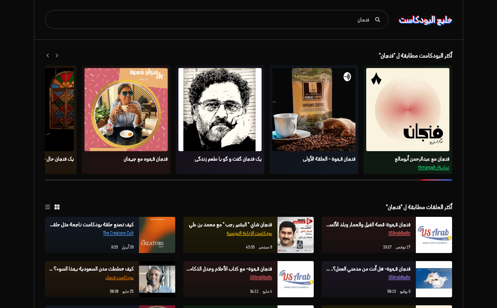

# Podbay Clone (خليج البودكاست)

A modern Arabic podcast search application that provides a comprehensive platform for discovering podcasts and episodes. Built as a full-stack solution with a responsive frontend and scalable backend architecture.

🌐 **Live Demo**: [https://podbay-nextjs.onrender.com/](https://podbay-nextjs.onrender.com/)



## 🎯 Project Overview

Podbay clone is a podcast discovery platform built as a job application assignment during hiring proces, featuring real-time search capabilities, responsive design, and a clean, modern interface. The application allows users to search for podcasts and episodes, with results stored locally for optimal performance.

## 🏗️ Architecture

The project consists of two main components:

### Frontend (Next.js 15)

- Modern React-based web application
- Real-time search with debouncing
- Responsive Arabic-first design with RTL support
- Interactive UI with smooth animations
- Multiple view modes (grid/list)

### Backend (NestJS)

- RESTful API service
- Multi-vendor podcast data integration
- PostgreSQL database for data persistence
- Scalable and modular architecture
- Comprehensive testing coverage

## 🌟 Key Features

### Search & Discovery

- **Real-time Search**: Debounced search with 500ms delay for optimal performance
- **Multi-Vendor Support**: Integration with iTunes Search API (extensible to other vendors)
- **Data Persistence**: Local storage of search results to reduce API calls
- **URL Persistence**: Search terms persist in browser URL

### User Experience

- **Arabic Support**: Full Arabic language support with RTL layout
- **Responsive Design**: Mobile-first approach with adaptive layouts
- **Interactive UI**: Smooth animations powered by Framer Motion
- **Multiple View Modes**: Grid and list layouts for episodes
- **Carousel Display**: Swipeable podcast cards with navigation controls
- **Loading States**: Custom loading animations and empty states

### Performance

- **Next.js 15**: Latest framework with improved performance
- **Turbopack**: Fast development builds
- **Code Splitting**: Automatic route-based splitting
- **Image Optimization**: Lazy loading and optimized images
- **Debounced Search**: Reduced unnecessary API calls

## 🚀 Tech Stack

### Frontend

- **Framework**: Next.js 15.3.4 with App Router
- **React**: React 19 with React DOM 19
- **Styling**: Tailwind CSS 4 with custom design tokens
- **Animations**: Framer Motion 12.18.1
- **Icons**: HackerNoon Pixel Icon Library
- **HTTP Client**: Axios 1.10.0
- **Date Handling**: Day.js with Arabic locale
- **Carousel**: Swiper.js 11.2.8

### Backend

- **Framework**: NestJS (TypeScript)
- **Database**: PostgreSQL
- **ORM**: TypeORM
- **Validation**: class-validator and class-transformer
- **HTTP Client**: Axios
- **Testing**: Jest

## 📁 Project Structure

```
podbay/
├── frontend/
│   ├── src/
│   │   ├── api/              # Axios configuration
│   │   ├── app/              # Next.js app router pages
│   │   ├── components/       # Reusable UI components
│   │   ├── hooks/            # Custom React hooks
│   │   ├── lib/              # Utility libraries
│   │   └── types/            # TypeScript definitions
│   └── package.json
└── backend/
    ├── src/
    │   ├── artist/           # Artist entities and services
    │   ├── episode/          # Episode entities and services
    │   ├── podcast/          # Podcast entities and services
    │   ├── search/           # Search functionality
    │   ├── vendor/           # External API integrations
    │   └── migrations/       # Database migrations
    └── package.json
```

## 🚀 Getting Started

### Prerequisites

- Node.js 18+
- PostgreSQL database
- npm or yarn

### Environment Setup

#### Frontend (.env)

```env
API_URL=http://localhost:3001
```

#### Backend (.env)

```env
PORT=3001
DB_HOST=localhost
DB_PORT=5432
DB_USERNAME=postgres
DB_PASSWORD=postgres
DB_DATABASE=podbay
NODE_ENV=dev
```

### Installation & Development

#### Backend Setup

```bash
cd backend
npm install
npm run start:dev
```

#### Frontend Setup

```bash
cd frontend
npm install
npm run dev
```

The application will be available at:

- Frontend: `http://localhost:3000`
- Backend API: `http://localhost:3001`

## 🔍 API Documentation

### Search Endpoint

```
GET /search?term={searchTerm}
```

**Response:**

```json
{
  "podcasts": [
    {
      "id": "string",
      "name": "string",
      "artworkUrl": "string",
      "artist": {
        "name": "string",
        "link": "string"
      }
    }
  ],
  "episodes": [
    {
      "id": "string",
      "name": "string",
      "description": "string",
      "durationMillis": "number",
      "releaseDate": "string",
      "podcasts": {
        "name": "string",
        "link": "string"
      }
    }
  ]
}
```

## 🧪 Testing

### Backend

```bash
cd backend
npm run test                    # Run all tests
```

### Frontend

```bash
cd frontend
npm run lint               # Run ESLint
```

## 🚀 Deployment

The application is deployed on Render and can be accessed at:
**https://podbay-nextjs.onrender.com/**

### Production Commands

#### Backend

```bash
npm run build
npm run start:prod
```

#### Frontend

```bash
npm run build
npm run start
```

## 📄 License

This project is licensed under the [MIT License](LICENSE.txt).

## 🤝 Contributing

Contributions are welcome! Feel free to open issues, suggest features, or submit pull requests to help improve the project.

---

Built with ❤️ and backpain.
